# ESP32-S3-MiniWebRadio V4 — Waveshare LVGL fork

This branch (`lvgl-ui`) is a fork of
[schreibfaul1/ESP32-MiniWebRadio](https://github.com/schreibfaul1/ESP32-MiniWebRadio)
targeting one specific board — the **Waveshare ESP32-S3-Touch-LCD-1.9**
(320×170 landscape, ST7789 SPI display, CST816 capacitive touch, 16MB
flash, 8MB octal PSRAM) — with its own **LVGL-based touchscreen UI**
replacing the upstream project's native `tftLib` UI entirely. The rest of
this README (below) is the original upstream project's general
documentation and still applies to the shared audio/network/web-UI core;
this section covers what's specific to this fork.

#### What's different here

- **UI**: full LVGL 8.3.11 rebuild (`src/ui/`) — dark-neon design, dot-matrix
  spectrum, vinyl-style cover art, cassette alternate view, on-device WiFi
  settings with a manual scan-and-connect flow, online lyrics lookup
  (lrclib.net) for local files. See `docs/UI_DESIGN_SPEC.md` and
  `docs/LVGL_MIGRATION.md`.
- **Flash layout**: single 12MB app partition, no OTA
  (`boards/miniwebradio16MB_single.csv`) — this board never used network
  OTA, and the freed 6MB went to the CJK font subset needed for the
  touchscreen UI. A pre-built, verified-correct bootloader is committed at
  `firmware/bootloader_dio_40m_esp32s3.bin` (this hybrid
  `framework = arduino, espidf` PlatformIO setup does not build its own —
  see the dev log below for why).
  **Flashing this layout onto a device that previously ran the old
  dual-partition scheme requires a full `esptool.py erase_flash` first.**
- **PlatformIO env**: build/flash with `esp32s3_OTA` (the name is legacy —
  it's the only environment used now, OTA itself was removed). Real WiFi
  credentials go in `platformio_override.ini` (gitignored) under
  `[env:esp32s3_OTA]` specifically — the default `_SSID`/`_PW` build flags
  are just `"SSID"`/`"PASSWORD"` placeholders.
- **Memory**: LVGL's own 96KB allocator pool lives in PSRAM
  (`LV_ATTRIBUTE_LARGE_RAM_ARRAY` in `src/lv_conf.h`), freeing internal
  SRAM that WiFi/audio both need at boot — see
  `docs/DEV_LOG_2026-07-28.md` for the full root-cause writeup of why
  WiFi/audio/LVGL couldn't all initialize together before this.

#### Build workflow for this fork

Use the checked-in wrapper scripts instead of running PlatformIO directly
from a path with spaces. PlatformIO/ESP-IDF has failed on Windows when the
project path contains whitespace, so the Windows script automatically builds
through a no-space junction path.

Windows:

```powershell
.\scripts\build_windows.ps1
```

The default target is `esp32s3_OTA`, and the default no-space build path is
`C:\mwr-src`. If that path is already in use:

```powershell
.\scripts\build_windows.ps1 -BuildPath C:\mwr-src-work
```

There is also an explicit `subst` fallback:

```powershell
.\scripts\build_windows.ps1 -UseSubst -BuildDrive Q:
```

To verify the resolved build path and PlatformIO executable without starting
a compile:

```powershell
.\scripts\build_windows.ps1 -CheckOnly
```

macOS/Linux:

```bash
./scripts/build_mac.sh
```

If the macOS/Linux path contains spaces, the script builds through
`/tmp/mwr-src` by default. Override that with `MWR_BUILD_LINK=/tmp/other-path`
if needed.

Both scripts default to `-j 1`. This is slower, but avoids the Windows
parallel-compile hang observed during the ESP-IDF full rebuild on this
machine. To override it:

```powershell
.\scripts\build_windows.ps1 -Jobs 4
```

```bash
JOBS=4 ./scripts/build_mac.sh
```

On Windows the wrapper builds the firmware with PlatformIO's `buildprog`
target by default. This still produces `.pio/build/<env>/firmware.bin` and
prints the normal PlatformIO RAM/Flash summary, but avoids the ESP-IDF CMake
`esp_idf_size` target that can fail on this machine because the PlatformIO
ESP-IDF helper Python environment and size-tool arguments are out of sync.
Use `-FullBuild` only when specifically debugging the default ESP-IDF size
target:

```powershell
.\scripts\build_windows.ps1 -Environment esp32s3 -Jobs 4
.\scripts\build_windows.ps1 -Environment esp32s3 -Jobs 4 -FullBuild
```

#### Dev logs (chronological, most recent last)

- `docs/DEV_LOG_2026-07-28.md` — WiFi/audio/LVGL memory root cause, radio
  offline-crash fix, WiFi settings UI redesign (saved-list + phone QR
  admin), online lyrics feature.
- `docs/DEV_LOG_2026-07-28_evening.md` — OTA→single-partition flash
  restructure (+ the bootloader-building saga), systemic font-blur fix
  (bpp 2→4), several real WiFi bugs (blocking-scan touch freeze, missing
  short-SSID handling, missing `esp_wifi_set_country_code`), new on-device
  manual add-network flow, two LVGL crash root-causes. **Has an open,
  unresolved issue at the bottom** — read it before touching WiFi
  credential code.
- `docs/DEV_LOG_2026-09-06_usb_dac_no_sound.md` — USB 声卡模式从「完全没有
  声音」到可用的四个根因（TinyUSB 回调改名导致的静默失效、全速 UAC2 反馈格式、
  预填水位自造断流、MSC 接口未关），声卡页三段式界面重做，以及排查方法论。
  **注意**：本轮修复只在 macOS 上验过，Windows/iOS/Android 尚未复测。

***

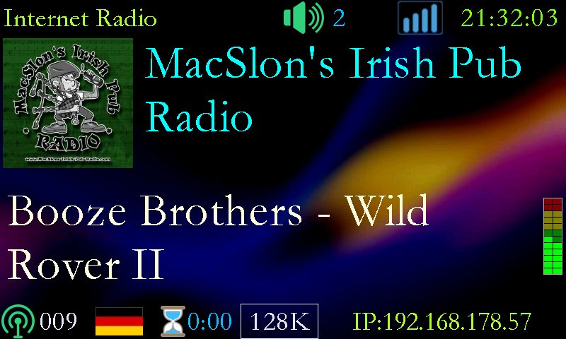

MiniWebRadio Features:
<ul>
<li>User interfaces: TFT touchscreen display, web browser and FTP</li>
<li>Functions: WiFi Radio, Digital Clock, MP3 player, Alarm, Sleep timer, adjust screen brightness, EQ settings and Volume, web browser User Interface, access SD card via FTP (e.g. FileZilla), IR remote controller support</li>
<li>Up to 999 pre-set stations can be held in stations.csv file on SD card (can edit using web UI)</li>
<li>Each station can display its own station icon (when saved to SD card)</li>
<li>Time is obtained via Network Time Protocol (NTP) from internet. Local Time Zone can be set from web UI</li>
<li>Web UI - MiniWebRadio can be accessed via any web browser (e.g. IE/Edge/Chrome/FireFox)</li>
<li>Internal SD card can be accessed via FTP (e.g. FileZilla)</li>
<li>Your home WiFi router SSID and password can be set using the browser on your smart phone (only required on first boot) or edit the networks.csv file on SD card</li>
<li>Play audio files on SD card or on DLNA home network (via web UI)</li>
<li>Use Infra-Red (IR) remote controller (38kHz NEC-encoded - e.g. arduino or mp3 remote). The web UI allows you to configure the buttons if required</li>
<li>One Alarm time can be pre-set using display (choose days, Monday-Sunday)</li>
<li>A Sleep timer can be set using display (switches off sound and screen after a pre-set time - max. 6 hours)</li>
<li>Can announce the time each hour when in radio mode (set via web UI)</li>
<li>Screen brightness can be adjusted using display (if the display has a backlight-pin)</li>
<li>Supports the Latin, Greek and Cyrillic character sets</li>
<li><a href="https://www.radio-browser.info/">Community Radio Browser</a> is integrated as a search engine. User can find new stations and then add them to the station list via web UI (with station icon if available) and then save the list and station icon file to the SD card</li>
<li>Channel lists can be exported or imported in Excel format (for data backup).</li>
</ul><br>
Required HW:
<ul>
<li>ESP32-S3 board <b>with 4MB PSRAM or larger</b></li>
<li>DAC (e.g. PCM5102a)</li>
<li>TFT Display with Touchpad (SPI), Display controller can be ILI9341 (320x240px), ILI9486 (480x320px), ILI9488 (480x320px), ST7796 (480x320px) or
RGB Display (800x480) with Touchpad (I2C) or DSI Display (1024x600) with Touchpad (I2C)  </li>
<li>SD Card (FAT32) + SD adapter (can use SD slot on back of TFT display if available)</li>

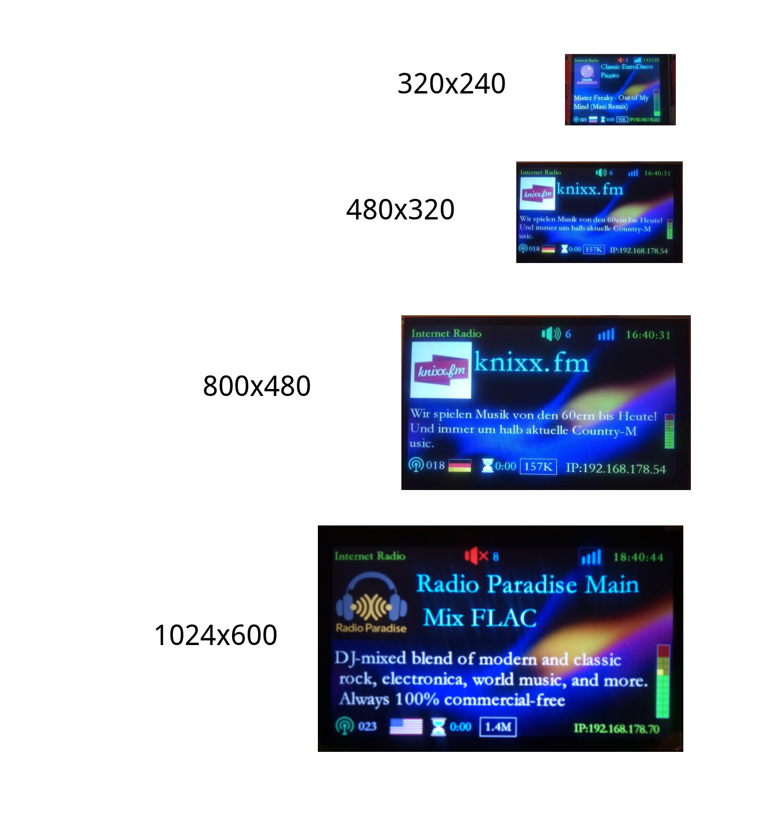
[Tested displays](docs/tested_displays.pdf)  

The display **"Crowpanel ESP32 P4-Advance HMI Display 7.0 V1.0 SKU:DHE04107D"** cannot be used due to a design error on the board!

</ul>
Optional HW:
<ul>
<li>IR receiver + IR remote controller according to the NFC protocol</li>
<li>KCX_BT_EMITTER V1.7, for connecting external Bluetooth devices, needs sufficient free GPIOs</li>
<li>BH1750 light sensor: The BH1750 has a wide range of values, which is still sufficiently sensitive at average room brightness. On the display, you can set the desired brightness when the sensor is darkened. Then the display is dimmed to this value 'at night', needs sufficient free GPIOs.</li>
</ul><br>

Control is via the display touchscreen or a web page in a browser, no additional components such as switches, rotary encoders, capacitors or resistors are required.

Schematic<br>SPI Display
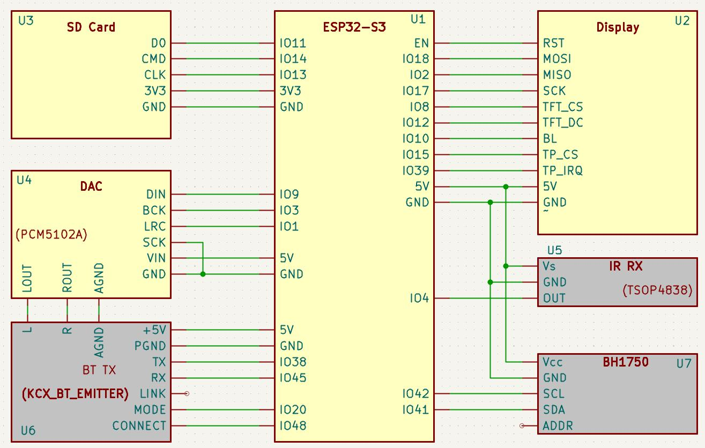<br>
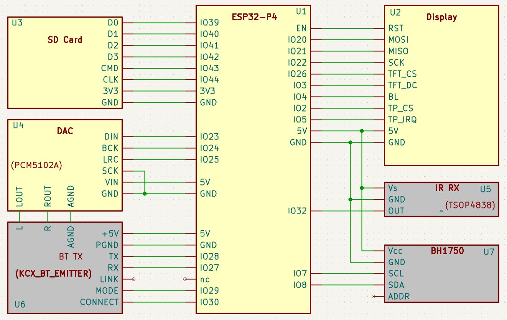<br>
<br>RGB Display
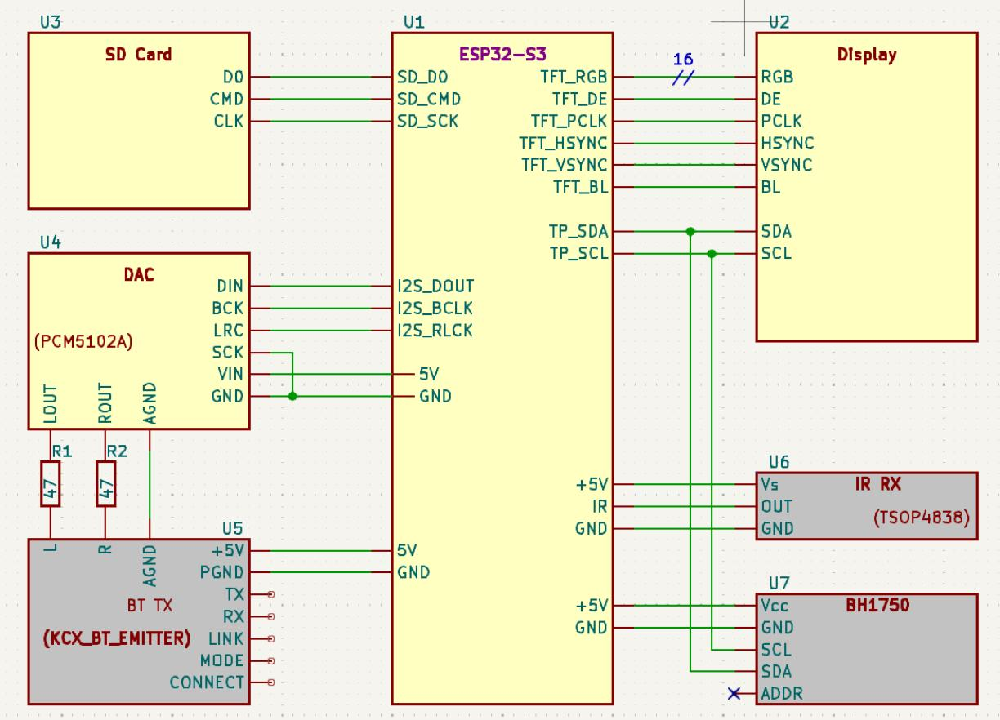<br>
<br>DSI Display
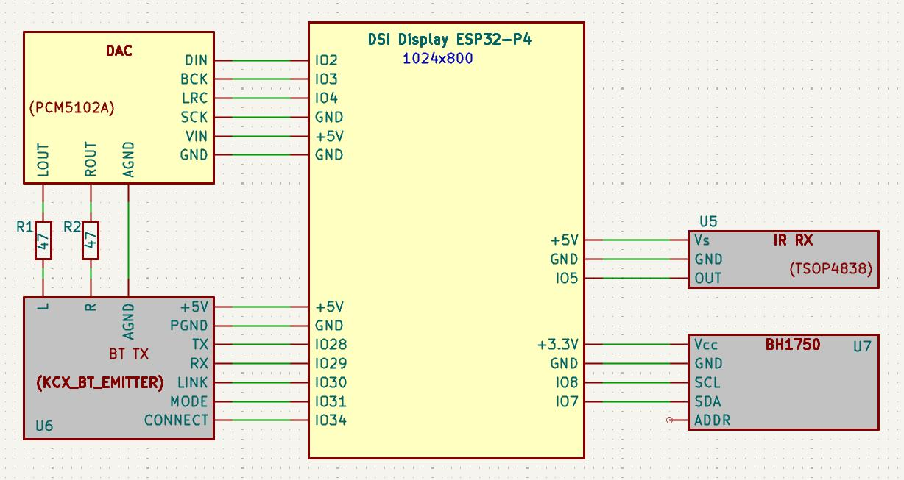<br>
<br>

[Display Layout](docs/MiniWebRadio%20V3.4%20Layout.pdf)<br>

[Using the Community Radio Browser](docs/Using%20the%20RadioBrowser.pdf)<br>

[How to install](docs/How%20to%20install.pdf) : PlatformIO is definitely recommended as the IDE.

#### Some features:

- The audioprocess works in its own task and is decoupled. This prevents dropouts when drawing on the display or when the website is loading.
- The SD card is wired as SD_MMC to improve stability and increase speed. This means that the GPIOs cannot be chosen freely. The [SD card adapter](docs/SD_Card_Adapter_for_SD_MMC_.jpg) must not have any resistors in series. For best display update speed, use 40MHz frequency for SD card if possible (SDMMC_FREQUENCY 40000000 in common.h).
- Audio can be decoded using software. Possible formats are mp3, aac, mp4, opus, vorbis and flac.
- External DACs (e.g. UDA13348, MAX98357A, PCM5102A) are connected via I2S, ES8388 and AC101 also require an I2C connection
- 480x320px display supported. The ILI9486 (SPI display from the Raspberry PI) is also supported
- The SD card files can be accessed via FTP. See settings for [Filezilla](docs/Filezilla.pdf). The username and password are 'esp32' (this can be changed in 'common.h')
- Access Point SSID/password can be set using mobile phone browser - no need to modify source code or networks.csv file on SD card
- Stations URLs support entry of username and password if the server expects access data, "URL|user|pwd"
- Can process local playlists in m3u format
- Either the ESP32 or the ESP32-S3 can be used (PSRAM is highly recommended)
- IR remote button codes can be changed by user using web UI
- Improved web UI reliability
- VU meter added to display
- Timezone can be set using web UI
- Play media files on home network DLNA (uPNP/DLNA app on smart phone, router, etc.)
- Prevent clicks when changing radio stations

<br>

|Codec       |                                                       |
|------------|-------------------------------------------------------|
| mp3        | y                                                     |
| aac        | y                                                     |
| aacp       | y (+SBR, +PS)                                         |
| wav        | y                                                     |
| flac       | y (blocksize max 16KB)                                |
| vorbis     | y <=256Kbit/s                                         |
| m4a        | y                                                     |
| opus       | y (except hybrid mode)                                |


***
<br>

[self-made devices of the users](https://github.com/schreibfaul1/ESP32-MiniWebRadio/wiki/User-devices)<br>

***

## Known problems
### SD Card
In the simplest case, the SD card is connected directly to the ESP32
<br>
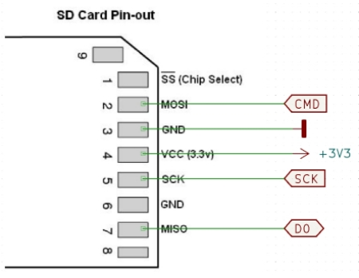<br>
Some SD card adapters for displays use series resistors. These are useless and in many cases harmful. Therefore, it is better to remove them and replace them with solder bridges.<br>
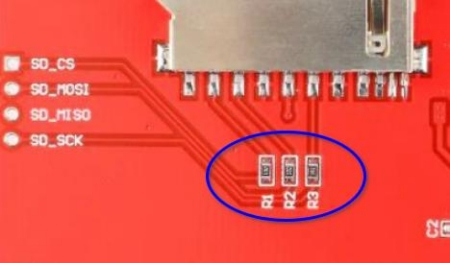<br>
If an ESP32 is used, any existing pull-up resistor at pin D0 must be removed (ESP32 - bootstrap pin). This will be added again later via SW. This is not necessary with the ESP32-S3.
(Photo from the <a href="https://forum.espuino.de/"> ESPuino </a>forum)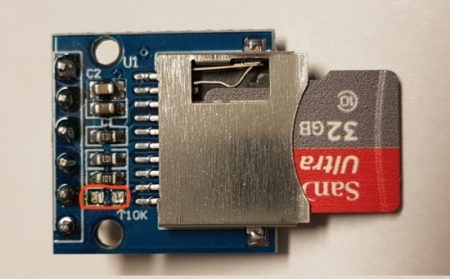<br>

### Display
Many displays can be used without any problems. If the touchpad does not work, it may be that the TFT controller does not enable the SPI bus. This is the case with my ILI9488 display. Then MISO of the TFT controller must not be connected.<br>
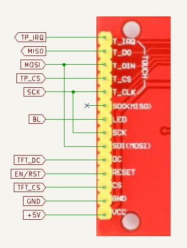
The values ​​of the PLCK frequency specified for RGB displays are not fully achieved. The reason for this is the high load of PSRAM for audio processing.
<br>

### DAC
On some PCM5102 boards the solder bridges are missing on the back.<br>
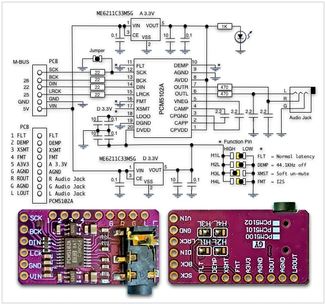<br>
This is how the DAC CS4344 is connected:<br>
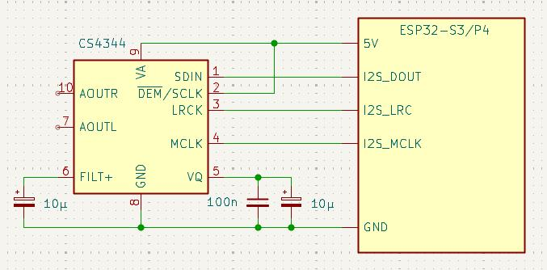<br>
This is how the DAC CS4344 is connected:<br>
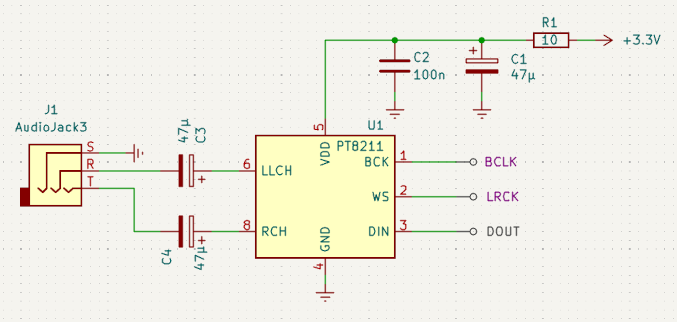<br>
If the DAC PT8211 is used, the *I2S_COMM_FMT* must be changed in common.h. This DAC requires Japanese LSBJ (Least Significant Bit Justified) format

### IR Receíver
Various 38KHz IR receivers can be used. While the TSOP4838 can be used without any problems, the VS1838B is very sensitive to high frequency fields despite its metal shielding. The VS1838B should not be installed near the WiFi antenna. The HS0038A2D is also suitable. HS0038 - HS0038A2 can be used with Vcc 5V.<br>
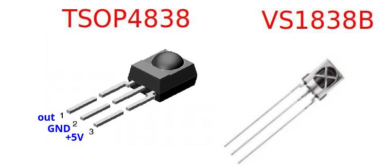<br>

### IR Remote Control
The remote control must support the NEC protocol. If several remote controls are operated in one room, they must have different address codes to avoid mutual interference. The "Arduino" remote control on the left in the picture uses the address code 0x00FF and the "Android X96" remote control (right) uses the address code 0x01FE.<br>
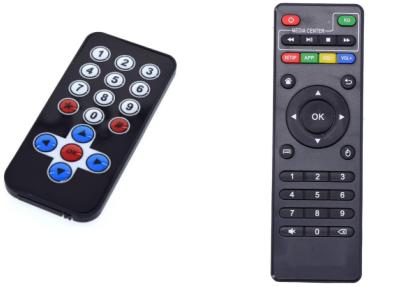<br>

### KCX_BT_EMITTER
The RT pin is not part of the soldering strip, but is located in the middle of the right side.<br>
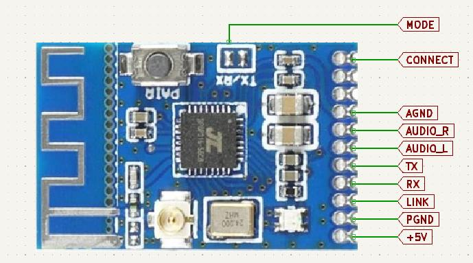<br>

### WiFi Credentials
If you see that, there are illegal characters in the WIFI access data. Sometimes only an `erase flash` help
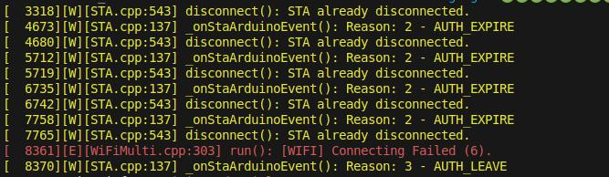<br>

<br>
___________________________________________________________
<br>

<br>
<br>


